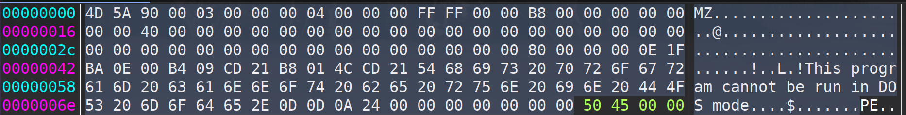

## PE File Structure

---

### PE File Header

* #### MS-DOS Header
  
  The first bytes of the PE file is occupied by the DOS signature and header. The first two bytes of this header will always be `0x4D5A`, which in ASCII is `MZ`. This is referred to as the signature. This magic number is one of the mutliple ways of identifying MS-DOS compatible files.
  
  

* #### MS-DOS Stub
  
  The MS-DOS stub is a valid application that runs under MS-DOS. It is placed at the front of the EXE image. The linker places a default stub here, which prints out the message "This program cannot be run in DOS mode" when the image is run in MS-DOS. 
  
  At location `0x3C`, the stub has the file offset to the the PE signature. This information enables Windows to properly execute the image file, even though it has an MS-DOS stub. So the length (in bytes) of the MS-DOS header is equal to the value at location `0x3c`

* #### Signature
  
  After the MS-DOS stub, at the file offset specified at offset `0x3C` , is a 4-byte signature that identifies the file as a PE format image file. The complete signature is `0x50450000` which in ASCII is `PE\0\0`.

* #### COFF File Header
  
  This header contains the following pieces of information as described in this table
  
  
  
  Based on the table above we have the following values for the example EXE
  
  * **Machine**: The follwoing two bytes 
    
    
    
    `0x4C01` written in big endian (`0x014C`) would indicate the target machine would be Intel 386 or later processors and compatible processors.
  
  * **NumberOfSections**: The following two bytes
    
    
    
    `0x0D00` written in big endian (`0x000D`) indicate there are 13 sections in the section table.
  
  * **TimeDateStamp**: The following 4 bytes
    
    
    
    `0x61B7DC63` written in big endian (`0x63DCB761`) indicates that at the time the EXE was created it had been 1,675,409,249 many seconds since 00:00 January 1, 1970. This comes out to be about 53.09 years. Thus the EXE was created in Feb of 2023.
  
  * 
  
  
