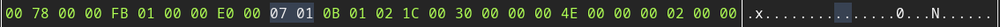

## PE File Structure

---

* #### MS-DOS Header
  
  The first 64 bytes of the PE file is occupied by the DOS header. The first two bytes of this header will always be `0x4D5A`, which in ASCII is `MZ`. This is referred to as the signature. This magic number is one of the mutliple ways of identifying MS-DOS compatible files.
  
  
  
  These 64 bytes are broken down into 19 members which define and outline the environment which the DOS EXE contained in the MS-DOS stub is run. One very note worthy member is located (and always located) at offset `0x3C`. The value at this address is equal to the offset of the PE signature which is a 4-byte signature that identifies the file as a PE format image file. 

* #### MS-DOS Stub
  
  The MS-DOS stub is a valid application that runs under MS-DOS. It is placed at the front of the EXE image and immediately after the DOS header. The linker places a default stub here, which prints out the message "This program cannot be run in DOS mode" when the image is run in MS-DOS. 
  
  

## NT Headers

* #### PE Signature
  
  After the MS-DOS stub, at the file offset specified at offset `0x3C` , is a 4-byte signature that identifies the file as a PE format image file. The complete signature is u`0x50450000` which in ASCII is `PE\0\0`.

* #### COFF File Header
  
  This header contains the following pieces of information as described in this table
  
  
  
  Based on the table above we have the following values for the example EXE
  
  * **Machine**: The first two bytes 
    
    
    
    `0x4C01`, written in big endian as`0x014C`, would indicate the target machines are be Intel 386 or later processors and compatible processors.
  
  * **NumberOfSections**: The next two bytes
    
    
    
    `0x0D00`, written in big endian as`0x000D`, indicate there are 13 sections in the section table.
  
  * **TimeDateStamp**: The following 4 bytes
    
    
    
    `0x61B7DC63`, written in big endian as`0x63DCB761`, indicates that at the time the EXE was created it had been 1,675,409,249 many seconds since 00:00 January 1, 1970. This comes out to be about 53.09 years. Thus, the EXE was created in Feb of 2023.
  
  * **PointerToSymbolTable**: The following 4 bytes
    
    
    
    `0x00780000`, written in big endian as`0x00007800`, indicates that the symbol table starts at offset `0x7800`.
  
  * **NumberOfSymbols**: The following 4 bytes
    
    
    
    `0xFB010000`, written in big endian as`0x000001FB`, indicates there are `0x1FB` = 507 entries in the symbol talbe.
  
  * **SizeOfOptionalHeader**: The following 2 bytes
    
    
    
    `0xE000`, written in big endian as`0x00E0`, indicates that the optional header is 224 bytes.
  
  * **Characteristics**: The last 2 bytes of the COFF header
    
    
    
    `0x0701`, written in big endian as `0x0107`, is the sum of the following bit flags
    
    * `0x0100`- IMAGE_FILE_32BIT_MACHINE: Machine is based on a 32-bit word architecture
    
    * `0x0004`- IMAGE_FILE_LINE_NUMS_STRIPPED: COFF line numbers have been removed.
    
    * `0x0002` - IMAGE_FILE_EXECUTABLE_IMAGE: Image only. This indicates that the image file is valid and can be run. If this flag is not set, it indicates a linker error.
    
    * `0x0001` - IMAGE_FILE_RELOCS_STRIPPED: Image only. This indicates that the file does not contain base relocations and must therefore be loaded at its preferred base address. If the base address is not available, the loader reports an error.  

* #### Optional Header
  
  This header is only meaningful (and required by) image files, i.e. EXE files. This header provides information to the [loader](reverse engineering - Where is the PE loader in Windows? - Information Security Stack Exchange](https://security.stackexchange.com/questions/24785/where-is-the-pe-loader-in-windows). Based on some of the values we observed in the previous section, namely, **SizeOfOptionalHeader**, we know the optional header to be 224 bytes.
  
  Let's orient ourselves before jumping back into the hex. Our PE signature occurred at the offset located at `0x3C`, which had a value of `0x80`. So at offset `0x80`, we found a 4-byte signature `0x50450000`. After these 4 bytes came the COFF header, which was broken down into the following byte lengths: 2, 2, 4, 4, 4, 2, 2. Thus with the PE signature and the COFF header, that places us 24 bytes beyond the `0x80` offset which places us at a relative address of `0x98`, and that is where we will start.
  
  * **Magic Number**: The first two bytes determines whether an image is a PE32 or PE32+ executable. 
    
    
    
    We see that the two bytes in our example EXE
    
    
    
    are `0x0B01 = 0x10B`. Thus our example EXE is of format PE32.
  
  * **MajorLinkerVersion**: The next byte 
    
    
    
    `0x02`, indicates the linker major versions number, which in this case is version 2.
  
  * **MinorLinkerVersion**: The following byte
    
    
    
    `0x1C`, indicates the linker minor version number, which in this case is 28.
  
  * **SizeOfCode**: The next 4 bytes
    
    
    
    `0x00300000 = 0x3000` shows that the sum of all code sections is equal to 12,288 bytes. 
  
  * **SizeOfInitializedData**: The next 4 bytes
    
    
    
    `0x004E0000 = 0x4E00` shows that the size of the initialized data section is equal to 19,968 bytes.
  
  * **SizeOfUninitializedData**: The next 4 bytes 
    
    
    
    `0x00020000 = 0x200` shows that the size of the uninitialzed data section (BSS) is equal to 512 bytes.
  
  * **AddressOfEntryPoint**: The next 4 bytes
    
    
    
    `0xE0120000 = 0x12E0` gives the address of the entry point relative to the image base when the executable file is loaded into memory. For program images, this is the starting address. 
  
  * **BaseOfCode**: The next 4 bytes
    
    
    
    `0x00100000 = 0x1000` gives the address that is relative to the image base of the beginning-of-code section when it is loaded into memory.
  
  * **BaseOfData**: The last 4 bytes
    
    
    
    `0x00400000 = 0x4000`is only present in PE32 executables. This is the address that is relative to the image base of the beginning-of-data section when it is loaded into memory.
